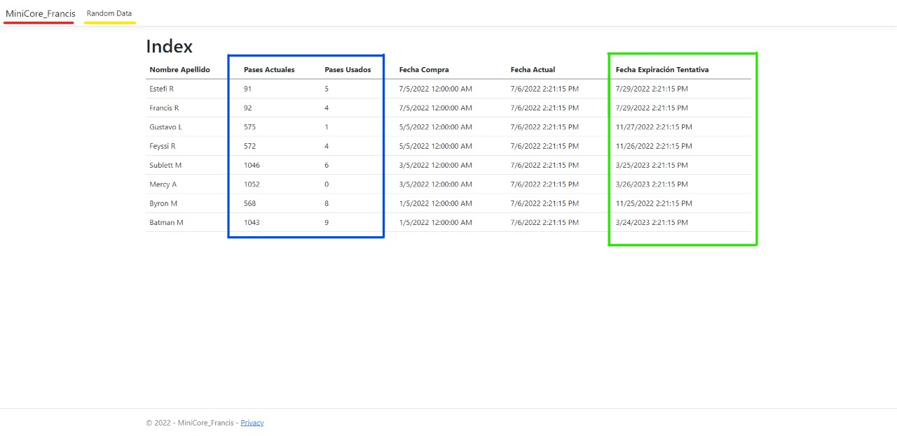

# Francios Rios || Ingenieria Web || Proyecto Minicore parqueadero

## Pila de Tecnologias

* Microsoft Visual Studio 2022 Community Edition
* Asp.Net MVC
* .Net 6
* SSMS (SQL Management Studio)
* Entity Framework
* Heroku
* Somee

## Enunciado

Enunciado

## Proyecto Deployado

[App en Heroku](https://github.com/)

## Imagen de la solución

### Sección ***MiniCore_Francis***

Está sección/link solo recarga la ruta actual de la app.

### Sección ***Random Data***

Al dar clic en este enlace la app generará datos de *Pases usados* aleatoriamente y se realizará el respectivo calculo de la fecha tentativa de expiración.

### Sección ***Azul***

Se puede visualizar los datos de los pases actuales y los ocupados en contraste con la fecha actual.

### Sección ***Verde***

Calculo y visualización de la fecha tentativa de expiración del pase.

## Contacto

* Nombre ...
* Correo ...
* Redes ...?